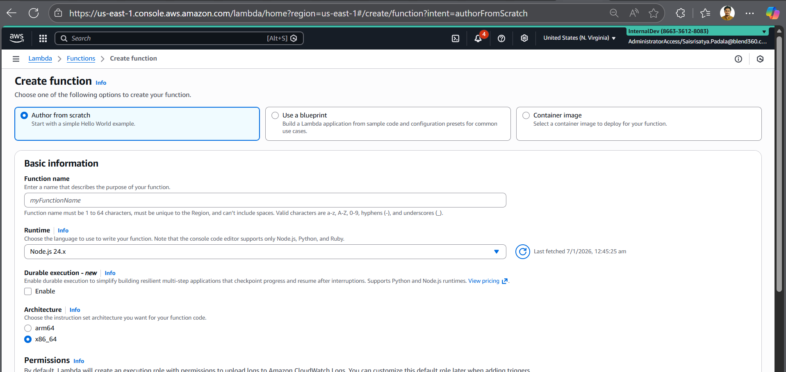
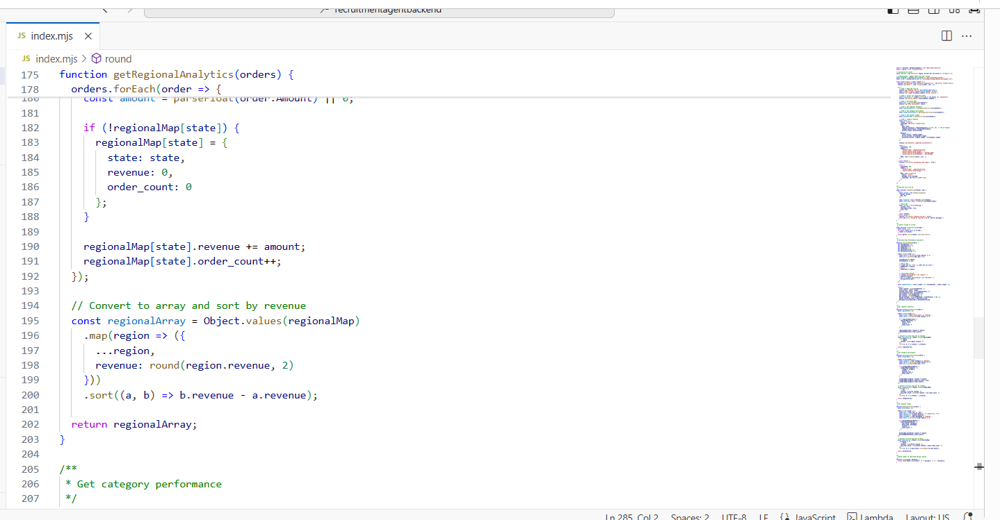
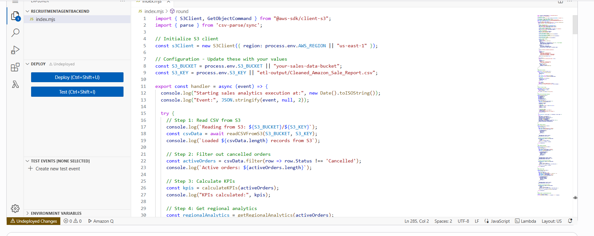
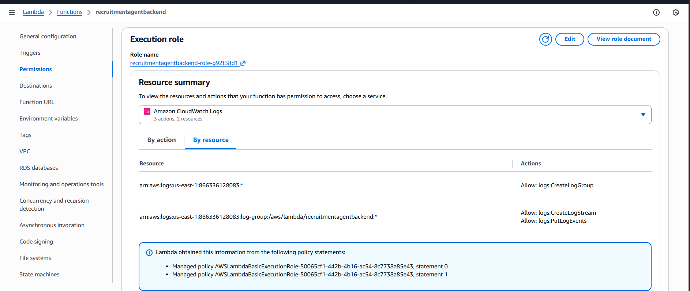
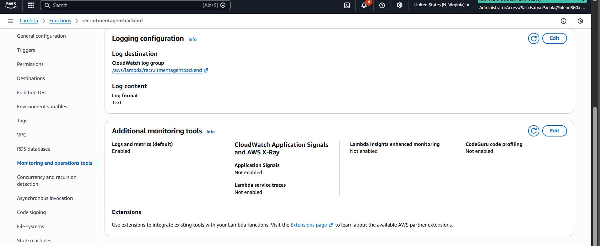
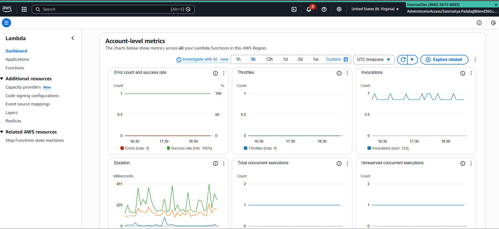

# 🚀 Sales ETL Serverless Analytics API

## 📋 Project Overview

A complete serverless ETL pipeline that processes Amazon sales data stored in AWS S3, calculates key performance indicators (KPIs), and exposes analytics through a REST API using AWS Lambda and API Gateway.

---

## 🎯 Features

- ✅ **ETL Pipeline**: Automated data cleaning and transformation
- ✅ **Serverless Architecture**: AWS Lambda for cost-effective scaling
- ✅ **REST API**: JSON-based analytics endpoint
- ✅ **Real-time Analytics**: Revenue, regional, category, and trend analysis
- ✅ **Scheduled Execution**: Daily automated updates via EventBridge
- ✅ **CloudWatch Logging**: Complete execution monitoring
- ✅ **CORS Enabled**: Cross-origin API access

---

## 📊 Architecture Diagram

```
┌─────────────────┐
│   AWS S3        │
│  Sales CSV Data │
└────────┬────────┘
         │
         ▼
┌─────────────────┐      ┌──────────────────┐
│  AWS Lambda     │◄─────┤  API Gateway     │
│  Analytics API  │      │  /analytics      │
└────────┬────────┘      └──────────────────┘
         │
         ▼
┌─────────────────┐      ┌──────────────────┐
│  CloudWatch     │      │  EventBridge     │
│  Logs           │      │  (Daily Trigger) │
└─────────────────┘      └──────────────────┘
```

---

## 🛠️ Technology Stack

| Component | Technology |
|-----------|-----------|
| **Language** | Python 3.9 / JavaScript (Node.js 20.x) |
| **Cloud Provider** | AWS (Amazon Web Services) |
| **Compute** | AWS Lambda |
| **Storage** | Amazon S3 |
| **API** | API Gateway (REST API) |
| **Scheduling** | Amazon EventBridge |
| **Monitoring** | CloudWatch Logs |
| **Libraries** | Boto3, Pandas (Python) / AWS SDK v3, csv-parse (Node.js) |

---

## 📂 Project Structure

```
week5/
├── index.mjs                          # Node.js Lambda function
├── lambda_function.py                 # Python Lambda function
├── etl_pipeline.py                    # ETL data processing script
├── test_lambda_locally.py             # Local testing script
├── template.yaml                      # CloudFormation/SAM template
├── requirements.txt                   # Python dependencies
├── package.json                       # Node.js dependencies
├── README.md                          # This file
├── Assignment.txt                     # Project requirements
├── Cleaned_Amazon_Sale_Report.csv     # Sales data (70MB)
└── screenshots/
    ├── index.png                      # Lambda console overview
    ├── index1.png                     # Lambda function details
    ├── createfunction.png             # Function creation
    ├── permissions.png                # IAM permissions
    ├── logging.png                    # CloudWatch logs
    └── dashboard.png                  # CloudWatch dashboard
```

---

## 🚀 Quick Start

### Prerequisites

- AWS Account with appropriate permissions
- AWS CLI installed and configured
- Python 3.9+ or Node.js 20.x installed
- Basic knowledge of AWS Lambda and S3

### Installation

```bash
# Clone or download the project
cd week5

# For Python Lambda
pip install -r requirements.txt

# For Node.js Lambda
npm install
```

---

## 📸 Screenshots & Setup Guide

### 1️⃣ Lambda Function Creation



**Steps:**
1. Go to AWS Lambda Console
2. Click **"Create function"**
3. Choose **"Author from scratch"**
4. Function name: `SalesAnalyticsAPI`
5. Runtime: Python 3.9 or Node.js 20.x
6. Click **"Create function"**

---

### 2️⃣ Lambda Function Overview



**Configuration:**
- **Function name**: SalesAnalyticsAPI
- **Runtime**: Python 3.9 / Node.js 20.x
- **Handler**: `lambda_function.lambda_handler` (Python) or `index.handler` (Node.js)
- **Architecture**: x86_64
- **Memory**: 512 MB
- **Timeout**: 60 seconds

---

### 3️⃣ Function Code & Environment



**Environment Variables:**
```bash
S3_BUCKET = "your-sales-data-bucket"
S3_KEY = "etl-output/Cleaned_Amazon_Sale_Report.csv"
```

**Code Upload Options:**
- Upload `.zip` file with dependencies
- Use inline code editor
- Deploy from S3 bucket
- Use Lambda layers for dependencies

---

### 4️⃣ IAM Permissions Configuration



**Required Permissions:**
```json
{
  "Version": "2012-10-17",
  "Statement": [
    {
      "Effect": "Allow",
      "Action": [
        "s3:GetObject",
        "s3:ListBucket"
      ],
      "Resource": [
        "arn:aws:s3:::your-sales-data-bucket",
        "arn:aws:s3:::your-sales-data-bucket/*"
      ]
    },
    {
      "Effect": "Allow",
      "Action": [
        "logs:CreateLogGroup",
        "logs:CreateLogStream",
        "logs:PutLogEvents"
      ],
      "Resource": "arn:aws:logs:*:*:*"
    }
  ]
}
```

**Execution Role**: `SalesAnalyticsLambdaRole`

---

### 5️⃣ CloudWatch Logs



**Log Groups:**
- `/aws/lambda/SalesAnalyticsAPI`

**Sample Log Output:**
```
START RequestId: abc123-def456-ghi789
Starting sales analytics execution at: 2024-01-07T10:30:00.000Z
Reading from S3: your-sales-data-bucket/etl-output/Cleaned_Amazon_Sale_Report.csv
Loaded 128563 records from S3
Active orders: 125430
KPIs calculated: {total_revenue: 8523450.50, ...}
Analytics completed successfully
END RequestId: abc123-def456-ghi789
REPORT RequestId: abc123-def456-ghi789
Duration: 2453.67 ms
Billed Duration: 2454 ms
Memory Size: 512 MB
Max Memory Used: 287 MB
```

---

### 6️⃣ CloudWatch Dashboard



**Metrics Monitored:**
- **Invocations**: Number of function executions
- **Duration**: Average execution time
- **Errors**: Failed invocations
- **Throttles**: Rate limit hits
- **Concurrent Executions**: Simultaneous runs

**Dashboard Widgets:**
- Lambda metrics over time
- Error rate percentage
- Recent log entries
- Cost estimation

---

## 🔧 Deployment Steps

### Method 1: AWS Console (Easiest)

1. **Upload CSV to S3**
   ```bash
   aws s3 cp Cleaned_Amazon_Sale_Report.csv s3://your-bucket/etl-output/
   ```

2. **Create Lambda Function**
   - Use screenshots above as reference
   - Upload `lambda_function.py` or `index.mjs`
   - Configure environment variables

3. **Add API Gateway Trigger**
   - Create new REST API
   - Add GET method on `/analytics` resource
   - Deploy to `prod` stage

4. **Add EventBridge Schedule**
   - Create rule with cron expression: `cron(0 8 * * ? *)`
   - Add Lambda as target

### Method 2: AWS CLI

```bash
# Create S3 bucket
aws s3 mb s3://sales-analytics-bucket

# Upload CSV
aws s3 cp Cleaned_Amazon_Sale_Report.csv s3://sales-analytics-bucket/etl-output/

# Create IAM role
aws iam create-role --role-name SalesAnalyticsLambdaRole \
  --assume-role-policy-document file://trust-policy.json

# Create Lambda function
aws lambda create-function \
  --function-name SalesAnalyticsAPI \
  --runtime python3.9 \
  --role arn:aws:iam::ACCOUNT_ID:role/SalesAnalyticsLambdaRole \
  --handler lambda_function.lambda_handler \
  --zip-file fileb://lambda-function.zip \
  --timeout 60 \
  --memory-size 512 \
  --environment Variables="{S3_BUCKET=sales-analytics-bucket,S3_KEY=etl-output/Cleaned_Amazon_Sale_Report.csv}"
```

### Method 3: CloudFormation

```bash
# Deploy using SAM/CloudFormation
aws cloudformation create-stack \
  --stack-name sales-analytics-stack \
  --template-body file://template.yaml \
  --capabilities CAPABILITY_NAMED_IAM
```

---

## 🧪 Testing

### Local Testing

```bash
# Python
python test_lambda_locally.py

# Output will be saved to test_output.json
```

### Lambda Testing

```bash
# Test via AWS CLI
aws lambda invoke \
  --function-name SalesAnalyticsAPI \
  --payload '{}' \
  response.json

# View response
cat response.json | jq .
```

### API Gateway Testing

```bash
# Test via curl
curl https://YOUR_API_ID.execute-api.us-east-1.amazonaws.com/prod/analytics

# Pretty print JSON
curl -s https://YOUR_API_ID.execute-api.us-east-1.amazonaws.com/prod/analytics | jq .
```

---

## 📊 API Response Example

```json
{
  "status": "success",
  "timestamp": "2024-01-07T10:30:00.000Z",
  "data": {
    "kpis": {
      "total_revenue": 8523450.50,
      "total_orders": 125430,
      "average_order_value": 679.45,
      "total_quantity_sold": 138650,
      "b2b_revenue": 3245000.00,
      "b2c_revenue": 5278450.50,
      "b2b_percentage": 38.07,
      "amazon_fulfilled_orders": 78950,
      "merchant_fulfilled_orders": 46480
    },
    "regional_analytics": [
      {
        "state": "Maharashtra",
        "revenue": 2145680.30,
        "order_count": 32450
      },
      {
        "state": "Karnataka",
        "revenue": 1856320.80,
        "order_count": 28340
      },
      {
        "state": "Tamil Nadu",
        "revenue": 1234560.50,
        "order_count": 19870
      }
    ],
    "category_performance": [
      {
        "category": "Kurta",
        "revenue": 3245890.00,
        "quantity_sold": 45230,
        "order_count": 42350,
        "avg_order_value": 766.55
      },
      {
        "category": "Top",
        "revenue": 2134560.00,
        "quantity_sold": 32450,
        "order_count": 30120,
        "avg_order_value": 708.81
      }
    ],
    "monthly_trends": [
      {
        "year_month": "2022-04",
        "month_name": "Apr",
        "revenue": 2845620.50,
        "order_count": 42350,
        "avg_order_value": 672.18
      },
      {
        "year_month": "2022-05",
        "month_name": "May",
        "revenue": 3124580.00,
        "order_count": 45680,
        "avg_order_value": 684.13
      }
    ]
  },
  "metadata": {
    "total_records": 128563,
    "active_records": 125430,
    "cancelled_records": 3133
  }
}
```

---

## 📈 Key Performance Indicators (KPIs)

| KPI | Description | Formula |
|-----|-------------|---------|
| **Total Revenue** | Sum of all order amounts | `SUM(Amount)` |
| **Total Orders** | Count of active orders | `COUNT(Order ID)` |
| **Average Order Value** | Mean revenue per order | `Total Revenue / Total Orders` |
| **B2B Revenue** | Revenue from business customers | `SUM(Amount WHERE B2B=True)` |
| **B2C Revenue** | Revenue from individual customers | `SUM(Amount WHERE B2B=False)` |
| **Fulfillment Split** | Orders by fulfillment method | `COUNT(fulfilled-by)` |

---

## 🔄 Scheduled Execution

**EventBridge Rule Configuration:**

```yaml
Schedule Expression: cron(0 8 * * ? *)
Description: Daily sales analytics refresh at 8 AM UTC
State: ENABLED
Target: Lambda Function (SalesAnalyticsAPI)
```

**Cron Expression Breakdown:**
- `0` - Minute (0)
- `8` - Hour (8 AM)
- `*` - Day of month (every day)
- `*` - Month (every month)
- `?` - Day of week (no specific day)
- `*` - Year (every year)

---

## 📝 CloudWatch Logs Guide

### Viewing Logs

**AWS Console:**
1. Go to CloudWatch → Log groups
2. Select `/aws/lambda/SalesAnalyticsAPI`
3. View log streams (sorted by last event time)

**AWS CLI:**
```bash
# Tail logs in real-time
aws logs tail /aws/lambda/SalesAnalyticsAPI --follow

# Get recent logs
aws logs tail /aws/lambda/SalesAnalyticsAPI --since 1h

# Query logs
aws logs filter-log-events \
  --log-group-name /aws/lambda/SalesAnalyticsAPI \
  --filter-pattern "ERROR"
```

### Log Insights Queries

```sql
-- Average execution duration
fields @timestamp, @duration
| stats avg(@duration) as avg_duration, 
        max(@duration) as max_duration,
        min(@duration) as min_duration

-- Error analysis
fields @timestamp, @message
| filter @message like /ERROR/
| sort @timestamp desc

-- Memory usage
fields @timestamp, @maxMemoryUsed, @memorySize
| stats max(@maxMemoryUsed) as peak_memory
```

---

## 💰 Cost Estimation

### AWS Lambda
- **Free Tier**: 1M requests/month + 400,000 GB-seconds
- **Beyond Free Tier**: $0.20 per 1M requests + $0.0000166667 per GB-second
- **Estimated Monthly Cost** (1000 invocations): ~$0.02

### API Gateway
- **Free Tier**: 1M API calls (first 12 months)
- **Beyond Free Tier**: $3.50 per million requests
- **Estimated Monthly Cost** (1000 calls): ~$0.0035

### S3 Storage
- **Free Tier**: 5 GB for 12 months
- **Standard Storage**: $0.023 per GB/month
- **File Size**: 70 MB = 0.068 GB
- **Estimated Monthly Cost**: ~$0.0016

### CloudWatch Logs
- **Free Tier**: 5 GB ingestion, 5 GB archive
- **Beyond Free Tier**: $0.50 per GB ingested
- **Estimated Monthly Cost**: ~$0.05

**Total Estimated Monthly Cost**: **$0.08 - $5.00**
*(Depending on traffic volume)*

---

## 🐛 Troubleshooting

### Common Issues

#### 1. Lambda Timeout Error
**Error**: `Task timed out after 3.00 seconds`

**Solution:**
```bash
aws lambda update-function-configuration \
  --function-name SalesAnalyticsAPI \
  --timeout 60
```

#### 2. Memory Error
**Error**: `Runtime exited with error: signal: killed`

**Solution:**
```bash
aws lambda update-function-configuration \
  --function-name SalesAnalyticsAPI \
  --memory-size 1024
```

#### 3. S3 Access Denied
**Error**: `An error occurred (AccessDenied) when calling the GetObject operation`

**Solution:**
- Verify IAM role has S3 read permissions
- Check bucket policy allows Lambda execution role
- Ensure bucket and key names are correct

#### 4. Module Not Found (Python)
**Error**: `Unable to import module 'lambda_function': No module named 'pandas'`

**Solution:**
```bash
# Create deployment package with dependencies
pip install pandas boto3 -t package/
cd package
zip -r ../lambda-function.zip .
cd ..
zip -g lambda-function.zip lambda_function.py
```

#### 5. API Gateway 502 Error
**Error**: `502 Bad Gateway`

**Solution:**
- Check Lambda function returns proper response format
- Ensure Lambda has API Gateway invoke permissions
- Verify integration type is AWS_PROXY

---

## 🔒 Security Best Practices

### 1. IAM Policies
- ✅ Follow principle of least privilege
- ✅ Use separate roles for different functions
- ✅ Regularly audit permissions

### 2. API Security
- ✅ Enable API key authentication
- ✅ Use AWS Cognito for user authentication
- ✅ Implement rate limiting
- ✅ Enable AWS WAF for API Gateway

### 3. Data Protection
- ✅ Enable S3 bucket encryption (SSE-S3 or SSE-KMS)
- ✅ Use VPC for sensitive data processing
- ✅ Enable versioning on S3 bucket
- ✅ Implement bucket policies to restrict access

### 4. Monitoring
- ✅ Enable CloudTrail for API auditing
- ✅ Set up CloudWatch alarms for errors
- ✅ Monitor unusual invocation patterns
- ✅ Regular log analysis

---
 